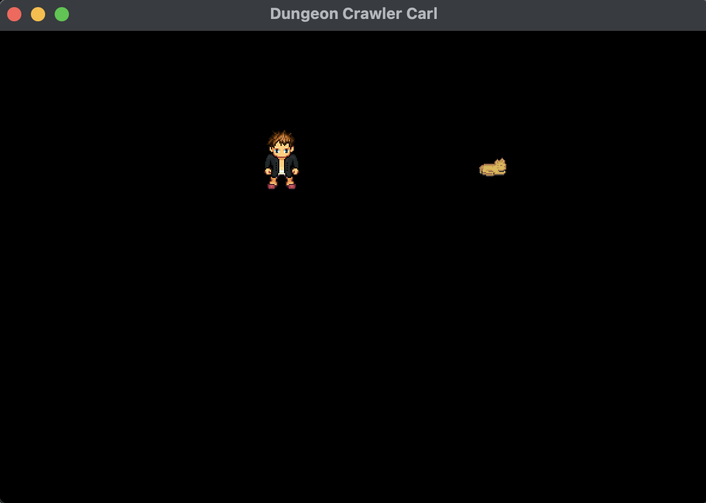
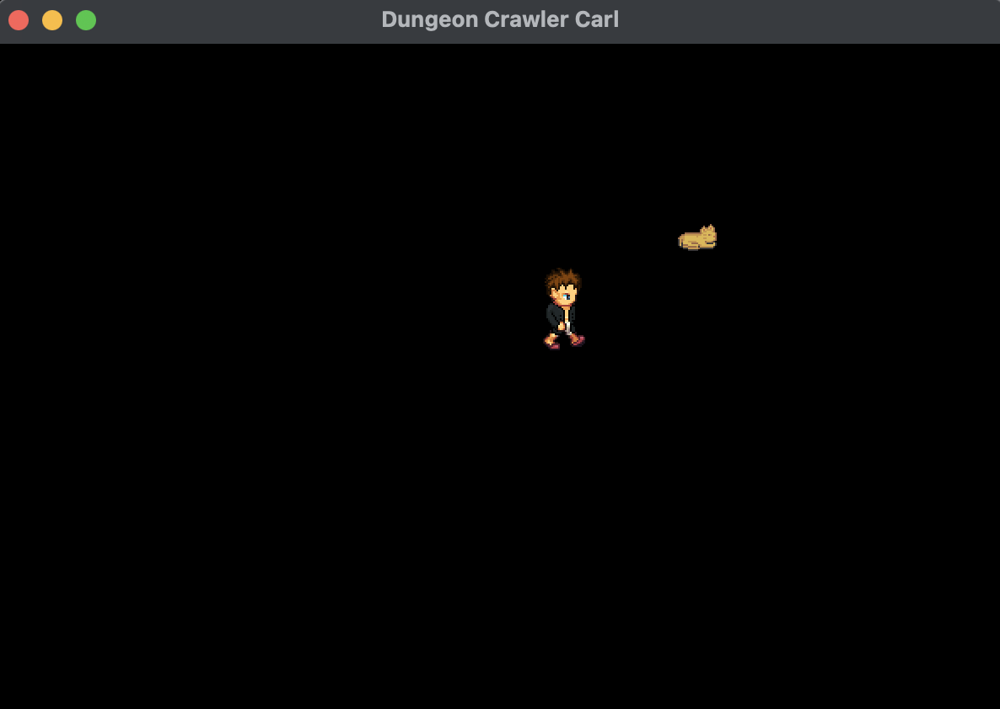

# DCCGame

C++ game based on the Dungeon Crawler Carl Series by Matt Dinniman

<h3>Refactor To-Do List</h3>
  <ul>
    <li>Movement function & walking animation
    - Not Started 5/8/25</li>
  </ul>

<h2>12th August 2025</h2>

<h2>11th August 2025</h2>

<h3>Tutorial Part 16 - Constructors, Destructors, Rendering Text </h3>

Render FPS - without Fraps
`FPS = 1000 / 16.67 ≈ 60`

To render, similar to sprite vs. texture relationship. `Text` is what is drawn but needs `Font` to say what to draw

```cpp
sf::Font font("../Assets/Fonts/Arial.ttf");
sf::Text frameRateText(font);
```

Reducing health
Destroy projectile when hits
Destroy projectile when outside

<h3>Tutorial Part 15 - Frame Rate </h3>

Uses Fraps to get frame rate we see that shooting bullets decreases frame rate, which slows the game.

`deltaTime` - Independent of frame rate

How long one frame takes to render. It will increase as my frame rate decreases to keep a stable game, we do this by:

1. Creating a clock and **restarting** it. I originally had it as reset and it tanked my game, do this in game loop.

2. From there we can calculate `deltaTime` and pass it in the Update loop

```cpp
  sf::Time deltaTimeTimer = clock.restart();
        float deltaTime = deltaTimeTimer.asMilliseconds();
```

3. We then times the movement of sprites by `deltaTime`

I understand its important to game function but there are no dopamine hits in these theory based lessons 😴

<h2>10th August 2025</h2>

Funnily enough in the AABB tutorial, towards the end, the dude realised there was a intersection method already built in. I decided to read the docs and see if I could implement that myself.

```cpp
sf::FloatRect otherBox = ...;
if (const std::optional intersection = boundingBox.findIntersection(otherBox))
{
    // collision!
}
```

Don't really understand the difference between `getLocalBounds()` and `getGlobalBounds()` but that seems like a future me problem.

<h2>8th August 2025</h2>

<h3>Tutorial Part 14 - AABB Collision Detection </h3>

Axis Aligned Bounding Boxes

1Right > 2Left && 2Right > 1Left

<h3>Tutorial Part 13 </h3>

The goal of today was to clean up my code by creating classes for **Carl**,**Donut**, etc. However, I am now having trouble compiling them. I added my new header file to my `Makefile` but that didn't fix the issue. I also added a constructor but that is now also causing issue. Frustrated, I knew as soon as I started moving code, I would run into an issue.

Okay, so note to self, check youtube comments. I think a general practise I should implement is setting a time limit to trying to figure something out myself, then after x mins, look for it in the comments/use AI. I also didn't check the documentation, which should have been my first stop.

Explanation of what I was struggling with:

When you make an object of your class (like player), C++ automatically tries to create all the smaller parts inside it — these are called member variables.

For something like texture, C++ knows how to make it by itself because it has a simple way to create it without any extra info (a default constructor).

But for sprite, since version 3 of SFML, it needs some info to be created — it can’t just be made out of thin air. It needs a texture to work.

So, C++ can’t make sprite automatically unless you tell it how — which means you have to give it the texture when you create it. You do this by writing:

`Carl::Carl() : sprite(texture) {
    // now sprite is created using the texture you provide
}`

Classes

- Header file (.h/.hpp) - not complied. It's a blueprint. No code to execute. Is useful so that the large chunks are code aren't in multiple places, faster and smaller. Reduce compilation time

- .cpp - complied. Code to execute

- Reference `&`

- Static - let you use a function without having to create an object. (not Carl carl;) just Math. Not good for things where the variables will change ie health between 2 players, update on the other would to. Use when multiple objects will share the same data.

<h2>7th August 2025</h2>

<h3>Tutorial Part 12 - Creating and firing projectiles 🔫 *pow pow</h3>

`Direction Vector` = Target - Current location

`normalize` - length of vector (magnitude = pythagoras) make it equal 1, so that it moves in smaller increments - illusion of motion. Not preset, so need to use the function below.

** May need to have a case for 0,0 division **

```cpp

#include <vector>
#include <math.h>

sf::Vector2f NormalizeVector(sf::Vector2f vector)
{
    float m = std::sqrt(vector.x *vector.x + vector.y * vector.y); //magnitude

    sf::Vector2f normalizedVector;

   normalizedVector.x = vector.x /m;
   normalizedVector.y = vector.y /m;


}
```

Steps for creating

1. Create NormalizeVector function outside main loop
2. Create vector projectiles, set shape - initialise
3. Create vector projectileDirection - initialise
4. Create variable for projectileSpeed - initialise
5. In game loop create `if` statement to add items to projectiles vector and set position of last item to position of firing sprite.
6. Game loop - `for loop` for each projectiles[i] - getting direction (sprite position - [i] position). - NormalizeVector(direction) - setPosition of i
7. in draw section - `for loop` that runs through projectiles vector and draws each i

This is all pretty straight forward logically, however remembering it all will take some practise.

<h2>6th August 2025</h2>

🎉 I forgot to mention I made it to my first goal yesterday. I was able to get **Carl** to move around the screen. Still need to finesse it with more character renders but it was for sure a win.

<p align="center">


</p>

Next goal is getting **Carl** to be able to interact with **Donut** and his environment, which is his apartment in the first level.

- Hexadecimal 0-F

- List - creates a variable for every event. ie (bullets)

`List<sf::sprite>` indexed based but in c++ its actual called a `Vector` and to add we use `push_back` and we use `size()` to get count

Example:

```cpp
std::vector<std::datatype> variable;

  variable.push_back(element);

std::cout << variable[index] << std::endl;

```

`size_t` an unsigned(non-negative numbers) integer type that can represent the size of the largest object your system can allocate. Use if vectors or containers you are using can't be negative. Otherwise use `int`

`capacity()` returns how many elements worth of memory have been allocated (reserved) in RAM

`reserve()` if vector size is known, you can reserve the amount/location of memory, meaning that during game loop if more items are added, there isn't a load being used to move the vector if capacity is reached. Best example case would be bullets, if there is a max amount of ammo, ie 200 bullets. The bullets vector can reserve 200 elements of memory, making the game faster.

<h2>5th August 2025</h2>

Ended up finishing up yesterday a little frustrated. As I mentioned before the tutorial I'm following is for an older version of SFML and I am working with SFML 3.0. I was having trouble getting my sprite to move around my screen with a key press event, it got to the point where I just needed to leave it and come back today with fresh eyes.

I solved the issue within 5 mins today... in the words of Ryland Grace I must have been in 'stupid mode'.

I've written the code for up,down,left and right by using a series of if statements, however, I feel there is probably a cleaner way to code this. So I will add it to my come back to it list.

<span style="color:orange; font-weight:bold;">By doing the movements outside the event loop, there is no delay in movement as the window class isn't being used.</span>

Next step, it rendering different sprites with the movement. And also create a limit to the movement, so the sprite can't be moved outside of the screen. Instead of watching the tutorial, I tried this myself by using `setTextureRect` in my `if `statement, which worked. I wonder again the code can be refactored. It doesn't seem to work for multiple renders though, when I did a quick google it looks like something called frames may be used. I will wait for the tutorial to cover that.

I found this really cool sprite generator - https://liberatedpixelcup.github.io/Universal-LPC-Spritesheet-Character-Generator/#

<p align="center">
  <strong>Here are my characters:</strong><br><br>

  <em>
    Carl sprite I generated — <a href="img/player/textures/sheet-credits.txt" target="_blank">Credit</a>
  </em>
  
  <em>
    Donut sprite from the "[LPC] Cats and Dogs" collection by bluecarrot16.<br>
    Licensed under CC-BY 3.0 / GPL 3.0 / GPL 2.0 / OGA-BY 3.0 — <a href="http://opengameart.org/content/lpc-cats-and-dogs" target="_blank">Source</a>
  </em>
</p>

<div style="text-align:center; display:flex; justify-content:center; gap:40px; align-items:center;">
  <div>
    <p><strong>Carl</strong></p>
    
  </div>
  
  <div>
    <p><strong>Donut</strong></p>
    
  </div>
</div>

<h2>4th August 2025</h2>

Another day, another Youtube tutorial.

- Texture - is a image made up of pixels. Can't 'draw' a texture only a sprite with a loaded texture.

- Sprite - can contain position, size, texture, scale, rotation. Apply/wrap a texture to the sprite and then move it.

<h2>3rd August 2025</h2>

The tutorial I am following is for an older version of SFML and when looking at the documentation to compare, it doesn't look like it has been updated either, which is interesting.

Still working my ways towards getting a pixel to move around the screen. Im interested in the idea of triple buffers, for example if you have a character that is about to move, the buffer will not know that is your intention until the event, so how useful is it?

Time will tell and by time I mean chatGPT. The way I understand it is that the buffer happens after the event not before, makes sense. So I guess the buffer just matches the screen until otherwise told.

What I learnt today:

- Vector 2f
  Origin (0,0) = (x,y) - which is in top left hand corner
  Used for position and direction.
  Can set a pivot point if needed to change origin point

- Antialiased shapes - smooth lines.

```cpp
#include <SFML/Graphics.hpp>

int main() {
    sf::ContextSettings settings;
    settings.antialiasingLevel = 8;

    sf::RenderWindow window(
        sf::VideoMode(800, 600),
        "SFML shapes",
        sf::Style::Default,
        settings)}

```

- I drew and moved a circle around, which once the movement is related to an event, I would have completed my first goal


<h2>2nd August 2025</h2>

That was painful. It took me 4hrs to get the compiler to work. I ended up finding this tutorial which was made within the month and was able to get to work from there. Also learned about Makefile, which is a helpful tool. I'm not sure why I can't just use the run button but you win some, you lose some.

https://www.youtube.com/watch?v=g4iqNGcw3-Q&ab_channel=SuboptimalEngineer

What I learnt today after the chaos:

- The game loop(update and draw functions), screen tearing (refresh rate imbalance) and triple buffers using 2 back-buffers.
- V-sync - monitor vs frames per second

<h2>1st August 2025</h2>

Still making my way through the online tutorial series, I've decided it will probably take about a month to work my way through. As I go I will be thinking about how each lesson related to my game.

Annoyingly, there is an issue with the SFML version I have installed and it doesn't like my code. This is where I get annoyed with self-learning because it takes ages to sort out issues, it would be good to have a mentor for things like this. I use chatGPT for this but sometimes I feel like I just go around in circles.

<h2>18th July 2025</h2>

https://www.youtube.com/playlist?list=PLs6oRBoE2-Q_fX_rzraQekRoL7Kr7s5xi

<h2>13th July 2025</h2>

15hr layover in Hong Kong finished off the intro course to C++

The thing I like about coding is that even though there are lots of languages the fundamentals are generally the same. So once you have a good understanding of loops and variables etc, you can use that knowledge as a blueprint to learn new things.

<h2>10th July 2025</h2>

<h3>Things to research:</h3>

<ol>Which 2D library to use</ol>
<ol>How to move an object around a screen</ol>

I feel like the fundamentals are very similar to Javascript, wondering if I should keep using CodeDex or just try jump in.

I got a copy of<a href="https://www.packtpub.com/en-us/product/sfml-game-development-by-example-9781785287343" target="_blank">
<em>SFML Game Development By Example: Create and develop exciting games from start to finish using SFML</em>
</a>

I saw a TikTok yesterday of some dude saying there's no point in learning C++. I'm not sure why I chose to understand it. Just struck out as interesting.

<h3>✅ Pros of C++</h3>
  <ul>
    <li>High performance and fast execution</li>
    <li>Fine control over memory and system resources</li>
    <li>Object-Oriented Programming (OOP) support</li>
    <li>Rich Standard Template Library (STL)</li>
    <li>Cross-platform compatibility</li>
    <li>Mature language with lots of community support</li>
    <li>Compatible with C code and libraries</li>
  </ul>

  <h3>❌ Cons of C++</h3>
  <ul>
    <li>Steep learning curve and complex syntax</li>
    <li>Manual memory management (risk of memory leaks, bugs)</li>
    <li>Lack of built-in safety features (e.g., garbage collection)</li>
    <li>Longer compile times</li>
    <li>Poor support for GUI/web out of the box</li>
    <li>Difficult debugging, especially with pointers/templates</li>
  </ul>

<h2>10th July 2025</h2>

It's funny how working towards a project that generally interests you is far more exhilarating than one that doesn't. Today, I did some more fundamental learning on Codedex. I'm also using ChatGPT to help answer questions that I have, such as 'Why do I need to use std:: to declare a string variable but not a double?'. I find its a good tool when self learning because you can just ask it the stupidest questions and you get a quick answer. I know using AI is a touchy subject but its not going anywhere so better to get on board then get let behind.

<h2>9th July 2025</h2>

After 12 months of not coding a single line of code, I thought it would be fun to dust of my skills and dive into a completely new language C++. Although I think about working in FinTech the most, working in gaming is something that has always been at the back of my mind. Imagine playing GTA and being able to say 'I coded that handbag you just stole off that Grandma'

I've decided to turn one of my favourite book series into a game, using the old-school Pokémon game as inspiration, like below. The reason for this is:

<li>Pokemon is ICONIC</li>
<li>I will be able to find graphics easily online, instead of spending 2 weeks drawing a tree and not coding</li>
<li>I assume there will be a lot of online resources to help me on my journey</li>
  <br>

<h3>To do list:</h3>

<ol>Scope out project: Write a brief 'script' of what the game will look like</ol>
<ol>Learn some basic C++: I have started a Codedex course just to compare to other languages I know</ol>
<ol>Look into how C++ integrates with 2D game framework or multimedia libraries</ol>

  <br>
<div style="white-space: nowrap;">
  
  
</div>

<h3>Scope/Script</h3>

Long-term goal one is to build the first level of the game.

Intro: Small room, Carl playing CoD, sleeping Donut (cat). Text appears, prompting the player to locate Carl's smokes. The player can walk around the room until they find it, interacting with other objects.
Once the cigarette is lit, the room fills with smoke. The player must quickly open the window, timed. Once the window opens, Donut jumps out into tree. Have to dress Carl for the cold, pink crocs and coat, walk down the stairs inside the apartment (or maybe just a lazy out one door and automatically outside.)
Then, when outside, something like the apple catcher game, Carl tries to coax Donut out of the tree, and branches fall, which he must avoid. After avoiding x amount of branches, Ms Parsons yells at him, the world collapses, and the dungeon appears. Carl and Donut enter > Level Two.

Step one:

Build initial background and make Carl be able to walk around it.

```

```
